<p align="center">
  
</p>

<h1 align="center">🧠 CORTEX</h1>

<p align="center">
  <strong>CORe + TEX — Unified AI Agent System</strong><br/>
  <em>DORY (Deep Orchestration & Reasoning sYstem) + PULSE (Persistent Unified Learning Session Engine)</em>
</p>

<p align="center">
  <a href="#-what-is-cortex">What is CORTEX?</a> •
  <a href="#-quick-start">Quick Start</a> •
  <a href="#-dory-component">DORY</a> •
  <a href="#-pulse-component">PULSE</a> •
  <a href="#-kiro-cli-integration">Kiro CLI</a> •
  <a href="#-codex-cli-integration">Codex CLI</a> •
  <a href="#-architecture">Architecture</a>
</p>

---

# 🧠 What is CORTEX?

**CORTEX** is a unified AI agent system that combines two complementary frameworks:

| Component | Full Name | Purpose |
|-----------|-----------|---------|
| [**DORY**](./dory) | Deep Orchestration & Reasoning sYstem | NVIDIA NIM-powered tool execution, RAG, and memory |
| [**PULSE**](./pulse) | Persistent Unified Learning Session Engine | Autonomous agent orchestration with session memory |

Together, they create a complete AI development assistant with:
- **44 custom tools** for file operations, code search, web research, vision, and more
- **RAG V2 pipeline** with hybrid retrieval (BM25 + Vector) and reranking
- **Persistent memory** that remembers across sessions
- **Autonomous agents** that can build entire applications
- **MCP integration** for universal tool access
- **Data flywheel** for continuous improvement
- **Full orchestration** via `dory_agent` tool

---

# 🚀 Quick Start

## Prerequisites

- **Node.js** 18+ (for DORY)
- **Python** 3.11+ (for PULSE)
- **NVIDIA API Key** from [build.nvidia.com](https://build.nvidia.com)
- **Kiro CLI** (for Dory agent) or **Codex CLI** (for PULSE)

## Installation

```bash
# Clone or download CORTEX
cd /path/to/CORTEX

# === DORY Setup ===
cd dory
npm install

# Create environment file
cp .env.example .env.local
# Edit .env.local and add your NVIDIA_API_KEY

# Start DORY web interface
npm run dev
# Open http://localhost:3000

# === PULSE Setup ===
cd ../pulse

# Copy to ~/.codex (PULSE home directory)
mkdir -p ~/.codex
cp -r agents prompts memory scripts tools skills rules ~/.codex/
cp autoogpt.py autoqagpt.py ~/.codex/
cp config.toml.example ~/.codex/config.toml
# Edit ~/.codex/config.toml with your settings
```

## Quick Commands

```bash
# === Kiro CLI (Recommended) ===
q          # Start Kiro with Dory agent
qquit      # Stop all MCP servers
qlog       # View live logs

# === Web UI ===
nv         # Start Dory web UI + Elasticsearch
nvquit     # Stop all services

# === PULSE (Autonomous) ===
~/.codex/autoogpt.py -p /path/to/project    # Build app
~/.codex/autoqagpt.py -p /path/to/project   # QA app
```

---

# 🐠 DORY Component

**Location:** `./dory/`

DORY is the NVIDIA NIM-powered backend providing tools, RAG, and memory.

## Features

| Feature | Description |
|---------|-------------|
| **44 Custom Tools** | File ops, bash, RAG, search, memory, vision, specialists, orchestration |
| **RAG V2 Pipeline** | Hybrid BM25+Vector retrieval with NVIDIA reranker |
| **Vector Memory** | Semantic memory that persists across sessions |
| **MCP Server** | Exposes all tools via Model Context Protocol |
| **Data Flywheel** | Logs interactions for future model fine-tuning |
| **Web Interface** | Next.js chat UI at localhost:3000 |
| **Full Orchestration** | `dory_agent` tool runs complete pipeline |

## NVIDIA Model Stack

All models accessed with a single `NVIDIA_API_KEY`:

| Model | Purpose |
|-------|---------|
| **Nemotron 3 Nano 30B** | Main LLM (1M context, MoE architecture) |
| **NV-EmbedQA 1B v2** | Embeddings (2048-dim vectors) |
| **NV-RerankQA 1B v2** | Reranking search results |
| **Nemotron Nano VL 12B v2** | Vision analysis |

## Tool Categories (44 Total)

| Category | Count | Tools |
|----------|-------|-------|
| **Orchestration** | 1 | `dory_agent` |
| **File System** | 5 | `file_read`, `file_write`, `bash`, `set_project`, `get_project` |
| **Vision** | 3 | `vision_analyze`, `ios_ui_review`, `compare_mockup` |
| **RAG** | 8 | `rag_ingest`, `rag_search`, `rag_query`, `rag_research`, `rag_stats`, `rag_clear`, `rag_validate`, `rag_update` |
| **Search** | 3 | `google_search`, `parallel_search`, `local_docs_search` |
| **Memory** | 3 | `memory`, `entity_memory`, `unified_memory` |
| **Code & Docs** | 4 | `github_analyzer`, `github_file_reader`, `code_documentation`, `documentation_specialist` |
| **Diagrams** | 2 | `mermaid_generator`, `quick_diagram` |
| **Specialists** | 9 | `search_specialist`, `report_planner`, `section_author`, `report_writer`, `report_compiler`, `report_extender`, `quality_reviewer`, `deduplicate_sources`, `reflection` |
| **Flywheel** | 4 | `flywheel_log`, `flywheel_stats`, `flywheel_export`, `flywheel_create_dataset` |
| **Reasoning** | 1 | `think` |

## New: dory_agent Tool

The `dory_agent` tool runs the complete Dory pipeline with full orchestration:

```typescript
dory_agent(message, conversation_history?)
```

**What it does:**
1. **Unified Context** - Automatically retrieves RAG + Memory before each LLM call
2. **Tool Orchestrator** - Smart tool selection based on query
3. **Feedback Optimizer** - Learns from past interactions
4. **Auto-RAG Updater** - Syncs knowledge base with high-quality responses
5. **Flywheel Evaluator** - Auto-scores responses
6. **Nudge System** - Ensures edits are made when requested

## Running DORY

```bash
cd dory

# Development mode (Web UI)
npm run dev

# MCP server only (for Kiro/Codex)
npx tsx mcp-server.ts
```

---

# 🔄 PULSE Component

**Location:** `./pulse/`

PULSE is the autonomous agent orchestration system with session memory.

## Features

| Feature | Description |
|---------|-------------|
| **Autonomous Agents** | Build entire apps with minimal intervention |
| **Tiered Memory** | Anchor (95%), Semantic (85%), Procedural (60%) attention |
| **Multi-Agent Modes** | Initializer, Coder, QA agents |
| **Session Persistence** | Remembers context across sessions |
| **Progress Tracking** | Visual progress from 0% to 100% |

## Agent Modes

| Mode | Prompt | Trigger |
|------|--------|---------|
| **Initializer** | `@1` → `1.md` | No feature_list.json or < 150 features |
| **Coder** | `@2` → `2.md` | Has features, not 100% passing |
| **QA** | `@3` → `3.md` | 100% features passing |

## Memory Tiers

| Tier | File | Attention | Contents |
|:----:|------|:---------:|----------|
| 🔴 **0** | `anchor.md` | **95%** | MUST/NEVER rules, project state |
| 🟠 **1** | `semantic.json` | **85%** | Facts, patterns, preferences |
| 🟡 **2** | `procedural.md` | **60%** | Code patterns, commands |

## Running PULSE

```bash
# Single app - Build
~/.codex/autoogpt.py -p /path/to/project

# Single app - QA
~/.codex/autoqagpt.py -p /path/to/project

# Monitor all running agents
~/.codex/scripts/monitor.sh

# Build all in-progress apps
~/.codex/scripts/run_autoogpt_inprogress.sh
```

---

# 🖥️ Kiro CLI Integration

**Recommended way to use CORTEX interactively.**

Kiro CLI (AWS) connects to DORY via the Dory agent configuration.

## Setup

### 1. Dory Agent Configuration

Located at `~/.kiro/agents/dory.json`:

```json
{
  "name": "dory",
  "description": "NVIDIA-only agent - uses nvidia-cli and context7 MCP tools",
  "mcpServers": {
    "nvidia-cli": {
      "command": "/opt/homebrew/bin/npx",
      "args": ["tsx", "/Users/home/Documents/nvidia-cli/mcp-server.ts"],
      "cwd": "/Users/home/Documents/nvidia-cli",
      "env": {
        "NVIDIA_API_KEY": "${NVIDIA_API_KEY}",
        "GOOGLE_API_KEY": "${GOOGLE_API_KEY}",
        "GOOGLE_CSE_ID": "${GOOGLE_CSE_ID}"
      },
      "timeout": 120000
    },
    "context7": {
      "command": "/opt/homebrew/bin/npx",
      "args": ["-y", "@upstash/context7-mcp", "--transport", "stdio", "--api-key", "${CONTEXT7_API_KEY}"],
      "timeout": 120000
    }
  },
  "hooks": {
    "agentSpawn": [
      { "command": "cat ~/.kiro/user-memory.md" }
    ],
    "postToolUse": [
      {
        "matcher": "@nvidia-cli/memory",
        "command": "auto-append to user-memory.md on remember operations"
      }
    ]
  },
  "model": "claude-opus-4.5"
}
```

### 2. User Memory Persistence

The `~/.kiro/user-memory.md` file persists preferences:

```markdown
# User Preferences & Memory

## Development Preferences
- **Favorite code/framework**: SwiftUI
- **Quality standards**: Production-ready with Apple documentation compliance

## Project Context
- **Current project**: iOS SpaceX App (3-2-1-Liftoff)
```

### 3. Shell Aliases

Add to `~/.zshrc`:

```bash
# Start Kiro with Dory agent
alias q="kiro-cli chat --agent dory"

# Stop all MCP servers
alias qquit="pkill -f 'mcp-server' ; pkill -f 'context7-mcp' ; echo '🛑 Dory servers stopped.'"

# View live logs
alias qlog="tail -f ~/.kiro/logs/*.log 2>/dev/null || echo 'No logs found'"
```

## What Kiro + Dory Provides

| Feature | Benefit |
|---------|---------|
| **Claude Opus 4.5** | Most capable model for complex coding tasks |
| **44 nvidia-cli tools** | Full file, RAG, search, memory, vision capabilities |
| **Context7 docs** | Always up-to-date library documentation |
| **Persistent memory** | Remembers preferences across sessions |
| **Hooks system** | Auto-injects context, auto-saves memories |

## Quick Start

```bash
q  # Start Kiro with Dory agent
```

---

# 💻 Codex CLI Integration

**For autonomous app building with PULSE.**

## Setup

### 1. PULSE Configuration

Located at `~/.codex/config.toml`:

```toml
model = "o4-mini"
model_provider = "openai"

[mcp_servers.dory]
command = "npx"
args = ["tsx", "/Users/home/Documents/CORTEX/dory/mcp-server.ts"]
cwd = "/Users/home/Documents/CORTEX/dory"
startup_timeout_sec = 120
tool_timeout_sec = 120
env = { NVIDIA_API_KEY = "${NVIDIA_API_KEY}" }
```

### 2. Alternative: NVIDIA NIM Provider

```toml
model = "nvidia/nemotron-3-nano-30b-a3b"
model_provider = "nvidia-nim"

[model_providers.nvidia-nim]
name = "NVIDIA NIM"
base_url = "https://integrate.api.nvidia.com/v1"
env_key = "NGC_API_KEY"
wire_api = "chat"

[mcp_servers.nvidia-cli]
command = "npx"
args = ["tsx", "/Users/home/Documents/nvidia-cli/mcp-server.ts"]
cwd = "/Users/home/Documents/nvidia-cli"
startup_timeout_sec = 120
tool_timeout_sec = 120
env = { NGC_API_KEY = "${NGC_API_KEY}", NVIDIA_API_KEY = "${NGC_API_KEY}" }
```

## Quick Start

```bash
# Build an app autonomously
~/.codex/autoogpt.py -p /path/to/project

# QA an app
~/.codex/autoqagpt.py -p /path/to/project
```

---

# 🏗️ Architecture

## Complete System Flow

```mermaid
flowchart TB
    subgraph User["👤 User"]
        WEB[Web Interface<br/>localhost:3000]
        KIRO[Kiro CLI<br/>Dory Agent]
        CODEX[Codex CLI<br/>PULSE]
    end

    subgraph DORY["🐠 DORY"]
        API[Next.js API<br/>Agent Endpoint]
        AGENT[Agent Core<br/>Tool Loop]
        ORCH[dory_agent<br/>Full Orchestration]
        RAG[RAG V2<br/>Hybrid Search]
        MEM[Vector Memory<br/>Semantic Store]
        MCP[MCP Server<br/>44 Tools]
        FLY[Flywheel<br/>Data Logging]
    end

    subgraph PULSE["🔄 PULSE"]
        LAUNCH[Launchers<br/>autoogpt/autoqagpt]
        AGENTS[Agent System<br/>Init/Code/QA]
        ANCHOR[Anchor Memory<br/>Session State]
        SCRIPTS[Scripts<br/>Automation]
    end

    subgraph NVIDIA["☁️ NVIDIA NIM"]
        LLM[Nemotron 3 Nano<br/>1M Context]
        EMB[NV-EmbedQA<br/>Embeddings]
        RR[NV-RerankQA<br/>Reranking]
        VIS[Nemotron VL<br/>Vision]
    end

    subgraph CTX7["📚 Context7"]
        RESOLVE[resolve-library-id]
        GETDOCS[get-library-docs]
    end

    WEB --> API --> AGENT
    KIRO --> MCP
    KIRO --> CTX7
    CODEX --> LAUNCH --> AGENTS
    
    AGENT --> ORCH
    AGENT --> RAG --> EMB
    AGENT --> MEM --> EMB
    AGENT --> MCP
    AGENT --> FLY
    RAG --> RR
    AGENT --> LLM
    MCP --> VIS
    
    AGENTS --> MCP
    AGENTS --> ANCHOR
    AGENTS --> SCRIPTS

    style DORY fill:#76b900
    style PULSE fill:#0984e3
    style NVIDIA fill:#1a1a2e
    style CTX7 fill:#e17055
```



## Directory Structure

```
CORTEX/
├── README.md                    # This file
├── cortex.config.json           # Unified configuration
├── install.sh                   # Installation script
│
├── dory/                        # NVIDIA NIM Backend
│   ├── app/                     # Next.js pages & API routes
│   │   ├── api/agent-chat/      # Main agent endpoint
│   │   ├── api/dashboard/       # Metrics dashboard
│   │   └── settings/            # Settings page
│   ├── lib/
│   │   ├── agents/              # Agent core, tools, RAG, memory
│   │   │   ├── tools/           # 44 tool implementations
│   │   │   ├── rag/             # RAG V2 pipeline
│   │   │   ├── memory/          # Vector memory store
│   │   │   ├── flywheel/        # Data logging
│   │   │   └── mcp-agent-runner.ts  # dory_agent orchestration
│   │   └── security/            # PII guard
│   ├── components/              # React UI components
│   ├── mcp-server.ts            # MCP server entry point (44 tools)
│   ├── sft_traces/              # High-quality traces for training
│   ├── dpo_traces/              # Low-quality traces for DPO
│   └── package.json
│
└── pulse/                       # Autonomous Agent System
    ├── agents/                  # Agent implementations
    │   ├── agent.py             # Main autonomous loop
    │   ├── agent_qa.py          # QA agent
    │   └── prompts/             # Agent prompts
    ├── prompts/                 # System prompts (1.md, 2.md, 3.md)
    ├── memory/                  # Memory templates
    │   ├── anchor.md            # Tier 0 memory
    │   └── procedural.md        # Tier 2 memory
    ├── scripts/                 # Automation scripts
    ├── tools/                   # Python tools
    ├── autoogpt.py              # Build launcher
    └── autoqagpt.py             # QA launcher
```

---

# 📊 Key Metrics

| Metric | Value |
|--------|-------|
| **Tools** | 44 custom implementations |
| **Context Window** | 1,000,000 tokens (Nemotron 3 Nano) |
| **Embedding Dimensions** | 2,048 (NV-EmbedQA) |
| **RAG Chunk Size** | 800 characters |
| **Quality Threshold** | 7/10 (for training data) |
| **Memory Tiers** | 3 (Anchor, Semantic, Procedural) |
| **Agent Modes** | 3 (Initializer, Coder, QA) |

---

# 🔒 Security

## PII Guard (DORY)

Automatically redacts sensitive data:

| Pattern | Replacement |
|---------|-------------|
| Email addresses | `[EMAIL_REDACTED]` |
| Phone numbers | `[PHONE_REDACTED]` |
| API keys | `[API_KEY_REDACTED]` |
| AWS keys | `[AWS_KEY_REDACTED]` |
| Private keys | `[PRIVATE_KEY_REDACTED]` |

## Best Practices

- Never commit `.env.local` or `config.toml` with real keys
- Use environment variables for all secrets
- Keep `~/.nvidia-cli/memory/` backed up but private

---

# 🌐 Environment Variables

### Required

```bash
# NVIDIA API Key (get from build.nvidia.com)
export NVIDIA_API_KEY="nvapi-xxx"
export NGC_API_KEY="nvapi-xxx"
```

### Optional

```bash
# Google Custom Search
export GOOGLE_API_KEY="AIzaSy..."
export GOOGLE_CSE_ID="..."

# Context7 (for live docs in Kiro)
export CONTEXT7_API_KEY="ctx7sk-..."

# OpenAI (for PULSE with Codex)
export OPENAI_API_KEY="sk-..."
```

---

# 📚 Additional Documentation

- **DORY Details:** See `dory/README.md` for complete tool documentation
- **PULSE Details:** See `pulse/README.md` for agent system documentation
- **Kiro Setup:** See `~/.kiro/README.md` for Kiro CLI configuration
- **AGENTS.md:** See `pulse/AGENTS.md` for agent configuration

---

# 🔮 Roadmap

- [ ] Fine-tune smaller models on flywheel data
- [ ] Add more specialist agents
- [ ] Improve RAG chunking for Swift/iOS
- [ ] Mobile app for remote access
- [ ] Voice input integration

---

<p align="center">
  <sub>Built with 🧠 CORTEX = DORY + PULSE</sub><br/>
  <sub>Powered by NVIDIA NIM • AWS Kiro • OpenAI Codex • ❤️</sub>
</p>
