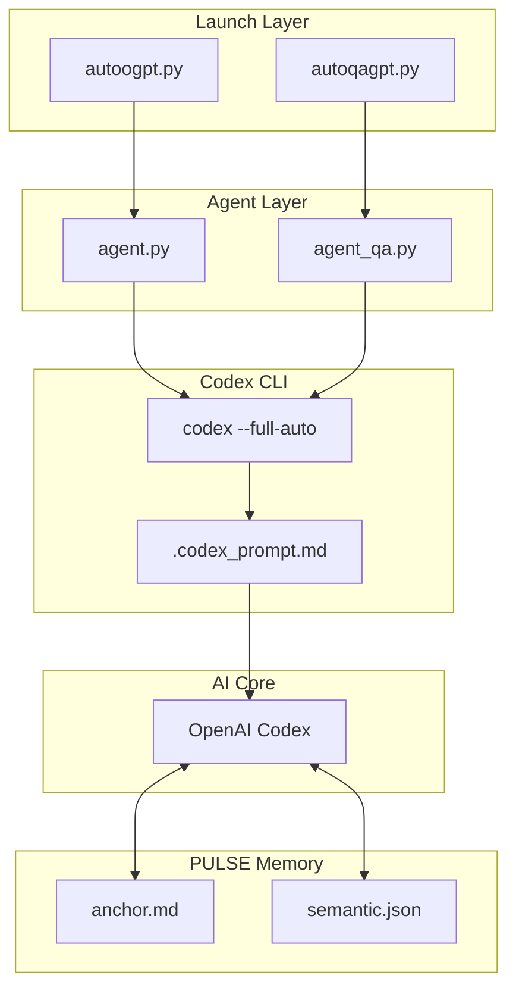
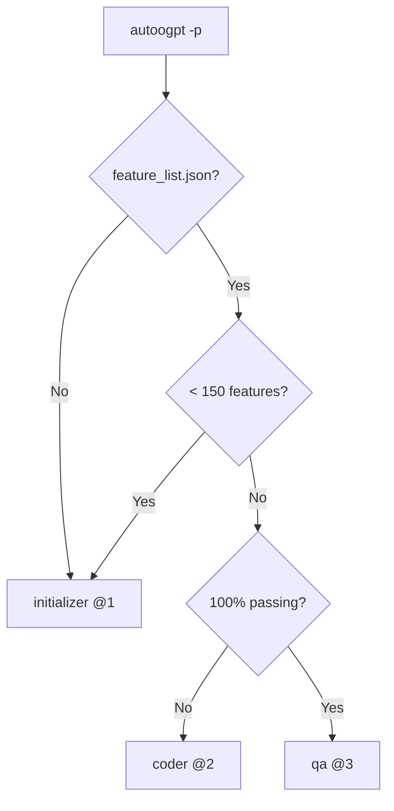

<p align="center">
  <a href="#-system-architecture"></a>
  <a href="#-quick-start"></a>
  <a href="https://openai.com/codex"></a>
  <a href="#-completion-pipeline"></a>
</p>

<h1 align="center">🧠 PULSE (Codex Edition) 🧠</h1>

<p align="center">
  <strong>Persistent—Unified—Learning—Session—Engine</strong><br>
  <em>Autonomous iOS Development System (Codex CLI)</em>
</p>

> **📝 Plain Text Output:** Agents run in headless mode (`--full-auto`) which outputs plain text reasoning instead of the interactive TUI. This makes it easier to follow the agent's thinking process during automation.

<p align="center">
  <a href="#-agent-system"></a>
  <a href="#-features"></a>
  <a href="#-completion-pipeline"></a>
</p>

<p align="center">
  <strong>Powered by <a href="https://openai.com/codex">OpenAI Codex CLI</a></strong><br>
  <em>Advanced reasoning, function calling, full autonomy</em>
</p>

---

## 🚀 Quick Start

```bash
# Single app - Build
autoogpt -p /Users/home/Documents/iOS/AppName

# Single app - QA
autoqagpt -p /Users/home/Documents/iOS/AppName

# Monitor all running agents
~/.codex/scripts/monitor.sh

# Build all in-progress apps
~/.codex/scripts/run_autoogpt_inprogress.sh
```

---

## 📁 Directory Structure

```
~/.codex/
├── 🚀 Launchers
│   ├── autoogpt.py              # Codex coding launcher
│   └── autoqagpt.py             # Codex QA launcher
│
├── 🤖 agents/
│   ├── agent.py                 # Main autonomous loop
│   ├── agent_qa.py              # QA agent loop
│   ├── qa_checklist.py          # QA verification
│   ├── progress.py              # Progress tracking
│   └── prompts.py               # Prompt management
│
├── 📝 prompts/
│   ├── 1.md                     # Initializer prompt
│   ├── 2.md                     # Coding prompt
│   ├── 3.md                     # QA prompt
│   ├── initializer_prompt.md    # Feature generation
│   ├── coding_prompt.md         # Implementation
│   └── qa_prompt.md             # QA verification
│
├── 🧠 memory/                   # PULSE memory system
│   ├── anchor.md                # Tier 0 (95% attention)
│   ├── semantic.json            # Tier 1 (85% attention)
│   └── procedural.md            # Tier 2 (60% attention)
│
└── ⚙️ scripts/
    ├── memory_sync.py           # Memory sync
    ├── ui_preflight.py          # UI checker
    └── monitor.sh               # Dashboard
```

---

## 🏗️ System Architecture



### CLI Execution Flow

```bash
# Agent writes prompt to temp file
echo "$PROMPT_CONTENT" > .codex_prompt.md

# Codex CLI reads and executes
codex --full-auto "Follow instructions in .codex_prompt.md"

# Output streamed back to agent
```

**Key flags:**
- `--full-auto` = Full autonomous mode, auto-approve all actions
- Positional argument = The prompt/instruction

---

## 🤖 Agent System

| Mode | Prompt | Trigger |
|:-----|:-------|:--------|
| **Initializer** | `@1` → `1.md` | No feature_list.json or < 150 features |
| **Coder** | `@2` → `2.md` | Has features, not 100% passing |
| **QA** | `@3` → `3.md` | 100% features passing |



---

## 🧠 PULSE Memory System

| Tier | File | Attention | Contents |
|:----:|:-----|:---------:|:---------|
| 🔴 **0** | `anchor.md` | **95%** | MUST/NEVER rules, project state |
| 🟠 **1** | `semantic.json` | **85%** | Facts, patterns, preferences |
| 🟡 **2** | `procedural.md` | **60%** | Code patterns, commands |

---

## 📊 Completion Pipeline

| Progress | Color | Features |
|:--------:|:-----:|:---------|
| 0-9% | 🔴 Red | 0-29 passing |
| 10-49% | 🟡 Yellow | 30-149 passing |
| 50-99% | 🟠 Orange | 150-299 passing |
| 100% | 🟢 Green | 300+ passing |
| Verified | ⚪ Gray | QA 100% |

---

## 🔄 Cross-System Compatibility

| System | CLI | Command | Config |
|:-------|:----|:--------|:-------|
| **Codex** | `codex` | `codex --full-auto "..."` | `~/.codex/` |
| **Kiro** | `kiro-cli` | `kiro-cli chat --agent X "@N"` | `~/.kiro/` |
| **Gemini** | `gemini` | `gemini -p "..." --yolo` | `~/.gemini/` |
| **Z.ai** | `claude` | `claude -p "..."` | `~/.zai/` |

All systems share the same PULSE memory format.

---

<p align="center">
  <sub>Built with 🧠 PULSE + 🤖 OpenAI Codex + ❤️</sub>
</p>
